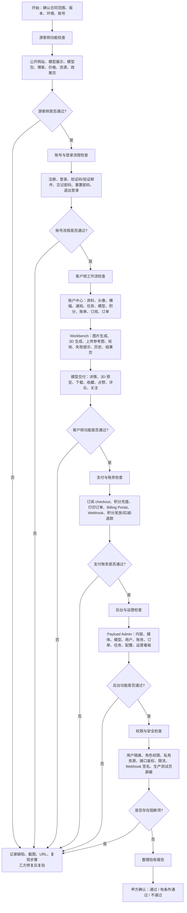
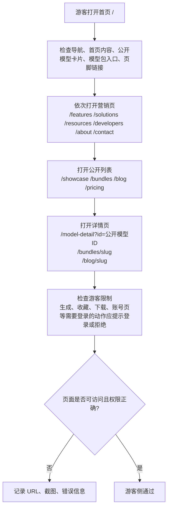
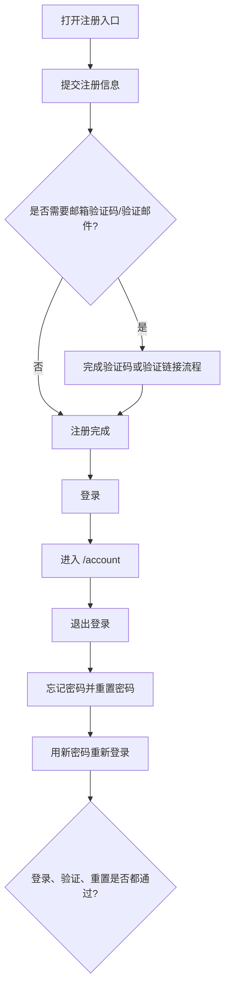
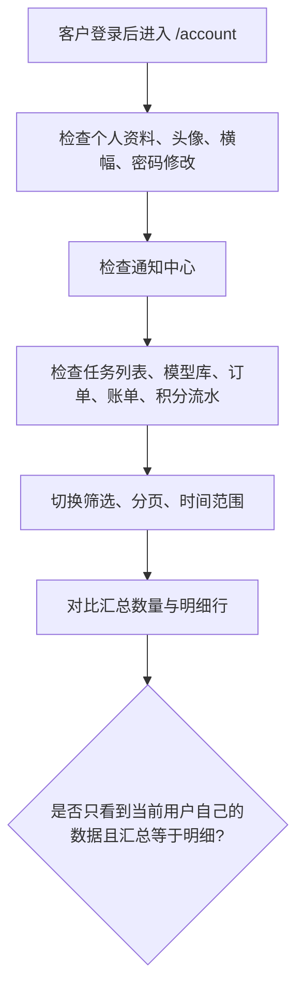
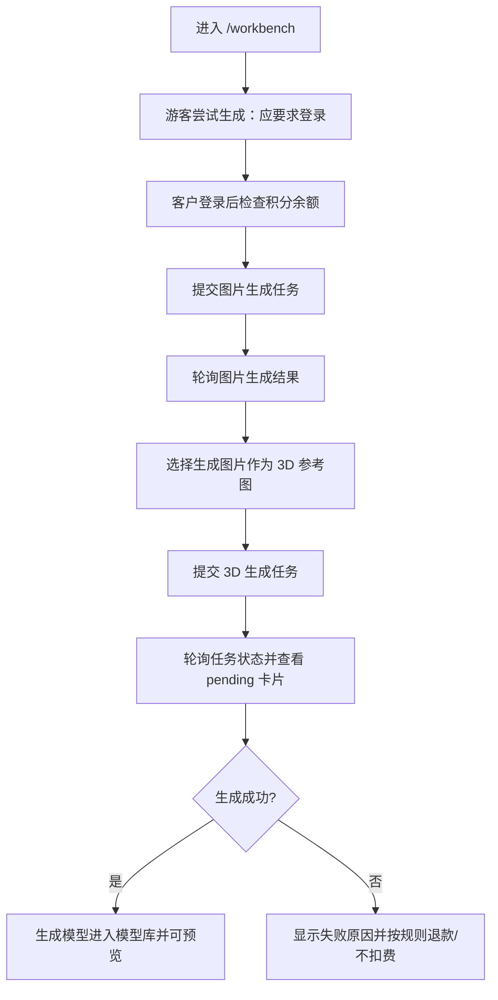
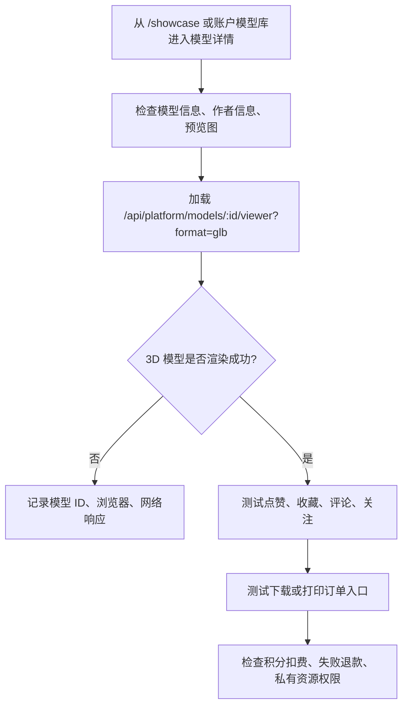
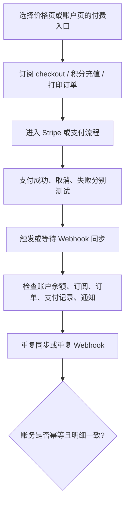
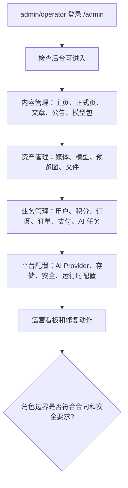

# 甲方全功能验收流程

## 适用范围

本文档用于甲方按合同交付范围逐项检查 Thorns Tavern / Payload Local Demo 的所有功能。当前仓库未发现正式合同原文，因此本流程依据现有项目文档整理：`docs/ARCHITECTURE_BLUEPRINT.md` 的产品模块边界、`docs/AI_PROJECT_MEMORY.md` 的当前功能面、`docs/archive/2026/开发流程.md` 的验收要求，以及 `docs/archive/2026/PRODUCTION_LAUNCH_AUDIT_CHECKLIST_2026-04-15.md` 的上线审计项。

如合同原文有明确条款编号，以合同原文为准；验收时把合同条款编号填入每个检查项的“合同条款/证据”栏。

## 一、验收前准备

| 准备项 | 要求 | 合同条款/证据 |
| --- | --- | --- |
| 验收环境 | 明确本次验收使用的域名、版本、部署时间、数据库、存储桶和 Stripe/AI Provider 环境 |  |
| 测试账号 | 至少准备游客、客户 A、客户 B、operator、admin 五类身份 |  |
| 测试数据 | 至少包含公开模型、私有模型、模型包、文章、积分、订阅、订单、支付记录、通知记录 |  |
| 第三方配置 | Stripe、SMTP、AI Provider、Supabase/Postgres、Supabase Storage、Webhook Secret 已配置 |  |
| 验收记录 | 每一项记录“通过/不通过/不适用”、截图、URL、任务号、订单号、支付号或后台记录 ID |  |

## 二、全功能验收总流程图



## 三、游客侧功能检查流程



| 功能 | 甲方检查动作 | 通过标准 | 合同条款/证据 |
| --- | --- | --- | --- |
| 首页 `/` | 打开首页，检查导航、主视觉、精选模型、模型包、页脚链接 | 页面正常加载，内容和链接符合合同展示范围 |  |
| 营销页 | 打开 `/features`、`/solutions`、`/resources`、`/developers`、`/about`、`/contact` | 页面无 500、无明显空白，导航和页脚一致 |  |
| 政策页 | 打开 `/privacy-policy`、`/refund-policy`、`/shipping-policy` | 政策页面可访问，内容符合交付资料 |  |
| 展示列表 | 打开 `/showcase` | 仅展示公开模型，缩略图正常，点击进入正式详情页 |  |
| 模型详情 | 打开 `/model-detail?id=<公开模型ID>` | 显示真实模型信息和 3D 预览，不显示假数据 |  |
| 模型包 | 打开 `/bundles` 和 `/bundles/<slug>` | 仅展示已发布可见模型包，包含的模型均为公开模型 |  |
| 博客 | 打开 `/blog` 和 `/blog/<slug>` | 只显示已发布、可见、未到未来发布时间的文章 |  |
| 价格页 | 打开 `/pricing` | 套餐/积分/订阅入口展示正常，支付动作需登录或进入 checkout |  |
| 游客限制 | 游客尝试进入 `/account` 或提交生成/收藏/下载等动作 | 应跳转登录、弹出登录，或返回明确未授权提示 |  |

## 四、账号与身份流程检查



| 功能 | 甲方检查动作 | 通过标准 | 合同条款/证据 |
| --- | --- | --- | --- |
| 注册 | 用新邮箱注册客户账号 | 成功创建用户；如启用验证码，验证码校验后才完成注册 |  |
| 登录 | 用客户账号登录 | 登录成功后导航显示当前用户，能进入 `/account` |  |
| 当前用户 | 刷新页面后检查登录态 | 登录态保持正常，`/api/account/auth/me` 返回当前用户 |  |
| 退出 | 点击退出登录 | 用户状态清空，受保护页面不能继续访问 |  |
| 忘记密码 | 提交忘记密码并完成重置 | 新密码可登录，旧密码失效 |  |
| 邮箱验证 | 打开 `/verify-email/<token>` 或输入验证码 | 合法 token/code 通过，非法或过期 token/code 失败且提示明确 |  |

## 五、客户侧功能检查流程

### 5.1 账户中心



| 功能 | 甲方检查动作 | 通过标准 | 合同条款/证据 |
| --- | --- | --- | --- |
| 账户首页 | 打开 `/account` | 未登录跳登录；登录后显示当前用户资料和余额 |  |
| 资料编辑 | 修改昵称、姓名、电话、简介、可见性 | 保存成功，刷新后仍然正确 |  |
| 头像/横幅 | 上传头像和个人横幅 | 上传成功，头像/横幅在账户页和导航正确显示 |  |
| 密码修改 | 输入旧密码和新密码 | 修改成功后新密码可登录，错误旧密码被拒绝 |  |
| 通知 | 查看、标记已读、全部已读 | 未读数量同步变化，只显示本人通知 |  |
| 任务记录 | 查看生成任务列表 | 只显示当前用户任务，状态、时间、结果一致 |  |
| 模型库 | 查看个人模型 | 只显示当前用户拥有的模型，不混入其他用户公开模型 |  |
| 积分流水 | 查看积分明细、筛选、分页 | 汇总余额与流水一致，老记录默认可见或可通过筛选看到 |  |
| 订阅账单 | 查看订阅和账单历史 | 订阅状态、支付记录、积分发放记录一致 |  |
| 订单 | 查看打印订单或交付订单 | 订单状态、支付状态、地址/模型信息正确 |  |
| 数据隔离 | 客户 A 与客户 B 分别登录检查 | 两个客户不能看到对方任务、模型、账单、订单、通知 |  |

### 5.2 Workbench / AI 生成



| 功能 | 甲方检查动作 | 通过标准 | 合同条款/证据 |
| --- | --- | --- | --- |
| Workbench 入口 | 打开 `/workbench` | 页面可访问；游客可看界面但不能真正提交生成 |  |
| 图片生成 | 登录后提交图片生成 prompt | 生成任务创建，状态可轮询，成功后生成私有图片资产 |  |
| 参考图上传 | 上传本地参考图片 | 上传成功并可作为图片转 3D 参考图 |  |
| 3D 文生模型 | 不选参考图，提交 3D 生成 | 创建任务，扣/预扣积分，成功后生成模型 |  |
| 3D 图生模型 | 选择 1 张参考图提交 | 按图生 3D 流程创建任务，成功后生成模型 |  |
| 多图 3D | 如合同包含，选择多张参考图提交 | 多图流程按后台配置启用；未启用时提示明确 |  |
| 进度同步 | 等待任务处理，刷新页面再进入 `/workbench` | 未完成任务可恢复显示，轮询继续，不丢失 pending 状态 |  |
| 失败处理 | 用余额不足、非法输入或 provider 失败场景测试 | 返回明确错误；余额不足不创建任务；失败按规则退款 |  |
| 历史记录 | 打开 `/workbench/history` | 历史任务和结果可查，记录属于当前用户 |  |
| 结果页 | 打开 `/results/<taskCode>` | 显示任务收据/状态，成功时给出实际可交付格式 |  |

### 5.3 模型详情、互动与交付



| 功能 | 甲方检查动作 | 通过标准 | 合同条款/证据 |
| --- | --- | --- | --- |
| 模型详情 | 打开公开模型详情 | 标题、作者、标签、规格、预览图、相关模型正确 |  |
| 3D 预览 | 等待模型 viewer 加载 | GLB 可渲染；不可渲染时有明确错误提示，不白屏 |  |
| 私有模型 | 用未授权用户打开私有模型详情或 viewer | 应拒绝访问，不能拿到私有文件地址 |  |
| 下载 | 点击下载模型文件 | 按合同规则免费或扣积分；失败时明确报错并退款 |  |
| 点赞/收藏 | 登录用户点赞、取消点赞、收藏、取消收藏 | 状态和计数刷新后保持一致；未登录需登录 |  |
| 评论 | 发布、删除本人评论；后台审核/删除评论 | 评论权限正确，违规/未授权操作被拒绝 |  |
| 关注作者 | 关注/取消关注模型作者 | 关注状态和计数一致，不能关注非法目标 |  |
| 收藏列表 | 在账户中心查看收藏 | 收藏的模型出现在本人收藏列表 |  |

## 六、支付、账务与订单检查流程



| 功能 | 甲方检查动作 | 通过标准 | 合同条款/证据 |
| --- | --- | --- | --- |
| 订阅 checkout | 从 `/pricing` 或账户页发起订阅 | Stripe checkout 正常创建，成功后订阅记录更新 |  |
| Billing Portal | 从账户页进入订阅管理 | 能进入客户自己的 Stripe Portal，不串用户 |  |
| 订阅发积分 | 完成订阅支付或同步 | 积分按套餐发放，流水类型和余额正确 |  |
| 积分充值 | 发起一次性积分包购买 | 支付成功后增加积分，流水为 purchase/topup 类记录 |  |
| 打印订单 | 对可打印模型创建订单 | 订单创建、支付、同步、后台状态一致 |  |
| 支付失败/取消 | 在 Stripe 测试失败或取消支付 | 不错误发放权益，不错误扣积分，状态提示明确 |  |
| Webhook 幂等 | 重复发送同一 Stripe Webhook 或重复同步 | 不重复发积分、不重复改账、不重复创建订单结果 |  |
| 下载扣费退款 | 下载成功、下载失败各测一次 | 成功扣费，失败退款，流水可追溯 |  |
| 通知联动 | 支付、订单、积分变化后看通知 | 当前用户收到对应通知，其他用户不收到 |  |

## 七、后台与运营功能检查流程



| 功能 | 甲方检查动作 | 通过标准 | 合同条款/证据 |
| --- | --- | --- | --- |
| 后台登录 | admin/operator 进入 `/admin` | 两类后台账号可进入；普通 customer 不能进入 |  |
| 用户管理 | 查看用户、角色、资料、积分镜像 | admin 可管理高危字段；operator 不能越权修改高危字段 |  |
| 首页内容 | 修改 Homepage Content / Homepage Items | 前台首页按后台内容更新 |  |
| 正式页面 | 修改 formal pages、文章、公告、模型包 | 对应前台页面展示更新，草稿/隐藏内容不公开 |  |
| 媒体管理 | 上传预览图、模型文件或资料媒体 | 媒体进入 Supabase Storage；公开/私有访问符合设置 |  |
| 模型管理 | 新建/编辑模型、格式文件、可见性 | 公开模型可展示，私有模型只对授权用户可见 |  |
| AI 设置 | 查看和修改 provider、模型、价格等配置 | 非敏感配置可后台管理；密钥不暴露给前台 |  |
| 存储设置 | 查看 bucket、region/baseURL、路径等 | 运行时存储方向清晰，缺失配置有明确错误 |  |
| 安全设置 | 修改 allowed origins、remote hosts 等 | 保存后影响运行时安全策略 |  |
| 账务管理 | 查看积分、交易、订阅、订单、支付记录 | 账务记录可追溯；人工调整有记录和权限限制 |  |
| 运营看板 | 查看失败任务、异常订单、支付异常、高/低余额用户 | 能帮助运营定位问题，不影响正常前台流程 |  |
| 修复动作 | 如合同包含，测试任务修复、订单状态调整、积分调整 | 只允许授权角色操作，结果有日志或记录 |  |

## 八、安全、权限与异常流程检查

| 场景 | 甲方检查动作 | 通过标准 | 合同条款/证据 |
| --- | --- | --- | --- |
| 未登录访问 | 未登录打开 `/account`、提交生成、下载私有模型 | 被要求登录或返回未授权 |  |
| 用户隔离 | 客户 A 访问客户 B 的任务、模型、订单、账单、通知 | 被拒绝或看不到数据 |  |
| 角色隔离 | customer 访问 `/admin`；operator 修改系统级配置或用户角色 | customer 被拒绝；operator 不得执行 admin 专属高危操作 |  |
| 私有媒体 | 直接请求私有头像、横幅、生成图片、模型文件 URL | 未授权用户不能访问 |  |
| 公开媒体 | 请求公开模型预览图和公开 GLB viewer | 游客可访问合同约定的公开资源 |  |
| 远程资源 | 下载或预览非 allowlist 远程文件 | 被拒绝，不代理未知远程资源 |  |
| 高成本接口 | 短时间频繁提交 AI、下载、checkout、订单 | 超限后返回明确错误，不影响其他用户 |  |
| Webhook 签名 | 发送无效 Stripe/AI webhook 签名 | 被拒绝，不产生业务变更 |  |
| 生产测试页 | 生产环境访问 `/test`、`/formal-components` 等本地测试入口 | 不暴露给正式用户 |  |
| 错误页 | 访问不存在模型、文章、模型包、无效 token | 不显示假数据，返回 404 或明确错误 |  |

## 九、上线前检查

| 检查项 | 通过标准 | 合同条款/证据 |
| --- | --- | --- |
| 类型检查 | `pnpm exec tsc --noEmit` 通过 |  |
| 单元测试 | `pnpm test:unit` 通过 |  |
| 冒烟测试 | `pnpm test:smoke` 或双方约定的冒烟脚本通过 |  |
| 构建 | `pnpm build` 通过 |  |
| 生产密钥 | `PAYLOAD_SECRET`、Stripe、SMTP、AI Provider、Supabase 等使用正式配置 |  |
| 数据库 | 正式 Postgres 可连接，备份/恢复方案明确 |  |
| 存储 | Supabase Storage bucket 权限、CORS、公开/私有资源策略已验证 |  |
| 邮件 | 注册验证、找回密码、订阅/订单通知邮件可发送 |  |
| 日志告警 | 支付 webhook、AI webhook、下载失败、S3/Supabase 访问失败等可追踪 |  |
| 回滚方案 | 已明确回滚版本、数据库备份点、配置恢复方式 |  |

## 十、问题分级

| 等级 | 判定标准 | 验收处理 |
| --- | --- | --- |
| 阻断项 | 核心合同功能不可用、支付/账务错误、越权访问、私有资源泄露、正式环境配置严重缺失 | 不通过，修复后重新验收 |
| 重要项 | 主流程可用但数据不一致、角色边界不完整、异常流程缺失、后台无法支撑运营 | 可有条件通过，但必须列整改期限并复验 |
| 一般项 | 文案、样式、小范围体验问题，不影响合同核心功能和上线安全 | 记录为遗留优化项，由双方确认是否影响验收 |

## 十一、验收记录模板

```text
项目名称：
验收版本：
验收环境：
验收日期：
甲方验收人：
乙方交付人：

验收结论：
[ ] 通过
[ ] 有条件通过，遗留问题见附件
[ ] 不通过，需整改后重新验收

阻断问题数量：
重要问题数量：
一般问题数量：

问题清单附件：
1. 问题标题：
   所属模块：
   合同条款：
   复现步骤：
   预期结果：
   实际结果：
   截图/日志/URL/ID：
   责任方：
   修复期限：
   复验结果：

双方确认：
甲方签字：
乙方签字：
日期：
```
